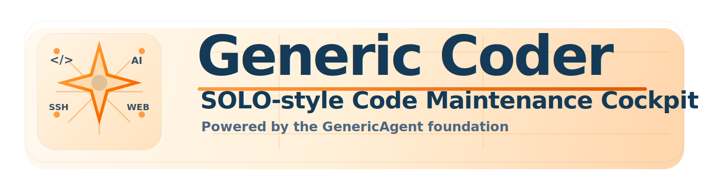

# Generic Coder


<div align="center">
  
</div>

<p align="center">
  <a href="#zh-cn">中文</a> | <a href="#en">English</a> | <a href="#es">Español</a>
</p>

<p align="center">
  An agentic code generation and editing cockpit — built on GenericAgent, designed for real-world development.
</p>

---

<a id="zh-cn"></a>
## 中文

### 概述

**Generic Coder** 是基于 **GenericAgent** 运行时而构建的 agentic 代码编辑工作台。它融合了现代 AI 编程工具的核心理念——Cursor 的 Diff 审查、Trae SOLO 的 Plan 模式、Copilot 的 Agent 编排、Zed 的多模型协作——同时保持极简、自包含的产品形态：无外部服务依赖，无需编辑器绑定，一个二进制即可在浏览器或桌面启动。

项目保留 GenericAgent 的四层记忆系统、工具驱动执行引擎与多模型切换能力，在此基础上补齐了代码搜索、Git 感知、变更审查、安全检查点、思考可视化等现代编程代理必备能力，形成了从"对话式 AI"到"专业级编码工作台"的完整演进。

### 与主流工具的定位对比

| 维度 | **Cursor** | **VS Code Copilot** | **Zed** | **Trae SOLO** | **Generic Coder** |
|---|---|---|---|---|---|
| 产品形态 | VS Code 分支 | IDE 扩展 | 原生编辑器 | IDE + 独立桌面 | **独立 Web + 桌面** |
| Agent 模式 | Composer / Agent | Ask / Agent / Edit | 多 Agent 共存 | Chat / SOLO | **统一 Agent Loop** |
| 代码搜索 | `@codebase` | `@workspace` | 编辑内搜索 | 项目搜索 | **ripgrep + Python 双引擎** |
| Git 集成 | ✅ 深度 | ✅ 深度 | ✅ | ✅ | **status / diff / log** |
| Diff 审查 | 逐 hunk accept/reject | 统一 diff 视图 | CRDT 实时 diff | DiffView 逐行 | **变更面板 + unified diff** |
| 安全检查点 | 每步快照 | 检查点恢复 | — | 一键回滚 | **自动备份 + 手动回滚** |
| 计划模式 | Composer 子任务 | Plan Agent | — | SOLO Plan | **Plan Mode + 进度追踪** |
| 多模型切换 | ✅ | ✅ | ✅ | ✅ | **UI 切换 + 预设** |
| 远程 SSH | 通过 MCP | 通过 MCP | — | 云端执行 | **内置 SSH + 远程执行** |
| 多渠道接入 | — | — | — | — | **Web/桌面/TG/QQ/微信/飞书/DingTalk** |
| 分发方式 | 下载安装 | 扩展市场 | 下载安装 | 下载安装 | **源码 + macOS/Win 安装包** |
| 开源 | 否 | 否 | 是 (ACP 开放) | 否 | **是** |
| 外部依赖 | IDE 绑定 | IDE 绑定 | 编辑器绑定 | 无 | **无 (自包含)** |

### 核心能力

**执行与工具链**
- **Agent Loop**：ReAct 风格多轮执行引擎，最大 70 轮自主决策，自动故障升级与重试策略
- **代码搜索** (`content_search`)：ripgrep 首选 + Python 降级方案，支持正则、glob 过滤、上下文行
- **Git 感知** (`git_status` / `git_diff` / `git_log`)：Agent 实时感知仓库状态，变更前自动评估
- **精确编辑** (`file_patch` + `file_write`)：基于唯一匹配的字符串替换，防止误改
- **代码执行** (`code_run`)：Python / Bash / PowerShell 沙箱执行，带超时与流式输出
- **浏览器控制** (`web_scan` / `web_execute_js`)：CDP 协议驱动，HTML 简化与 JS 注入
- **媒体处理** (`media_info` / `media_extract`)：PDF / DOCX / XLSX / 图片 / 视频元数据提取
- **远程操作** (`remote_*` 系列)：SSH 连接、远程命令执行、远程文件读写

**安全与审计**
- **自动备份**：每次 `file_patch` / `file_write` 前自动创建带时间戳的备份
- **文件回滚** (`file_revert`)：一键恢复到任意备份版本，Agent 可自主调用
- **变更审查**：Web UI 内置变更面板，实时展示文件修改的 unified diff
- **计划模式**：Agent 先出计划、用户审批、逐项执行、自动验证，进度条实时追踪

**UI 与交互**
- **思考可视化**：Agent 的 `<thinking>` 内部推理以可折叠面板展示，`<summary>` 阶段摘要以标签显示
- **语法高亮**：代码块根据语言自动着色（关键词、字符串、注释、数字）
- **命令面板** (`Cmd+K`)：全局命令搜索与快速执行
- **@文件引用**：在输入框中输入 `@` 触发工作区文件自动补全
- **会话标签页**：多会话快速切换，保留历史上下文
- **快捷键**：`⌘↩` 发送、`⌘⇧N` 新建、`⌘⇧S` 停止、`Esc` 关闭面板
- **图片输入**：支持粘贴/拖拽图片到输入框，自动上传并注入上下文
- **会话导出**：一键导出对话为 Markdown 文件
- **长输出折叠**：超长工具输出自动折叠，点击展开
- **5 套主题**：Solar Flare / Liquid Graphite / Neon Wave / Daybreak / Ember Core，适配不同光线环境

**记忆与自治**
- **四层记忆系统 (L1-L4)**：导航索引→环境数据→任务 SOP→原始日志，行动验证原则保证质量
- **自主调度器**：cron 式定时任务 + 空闲监测，Agent 可完全自主执行周期性工作
- **工作检查点**：长任务中 Agent 自动保存关键上下文，防止上下文窗口溢出导致信息丢失

**分发与部署**
- **Web 工作台**：Bottle 驱动，零配置启动，浏览器即开即用
- **桌面应用**：pywebview 包装，1440×940 原生窗口，支持空闲监测与后台 Bot
- **多渠道聊天接入**：Telegram / QQ / 企业微信 / 微信 / 飞书 / DingTalk，统一 Agent 后端
- **安装包生成**：macOS `.app` / `.dmg` / `.pkg`，Windows `.exe`，版本化发布

### 系统架构

```
┌─────────────────────────────────────────────────┐
│              用户接入层                           │
│   Web / Desktop / TG / QQ / WeChat / Feishu / DT │
├─────────────────────────────────────────────────┤
│           GenericCoderState / AgentChat           │
│        会话管理 · 流式传输 · 命令路由               │
├─────────────────────────────────────────────────┤
│          GenericAgent (agentmain.py)              │
│        任务队列 · LLM 切换 · 斜杠命令 · 中止          │
├───────────────┬──────────────┬──────────────────┤
│  agent_loop   │    ga.py     │   llmcore.py     │
│  回合引擎      │  工具处理器    │   多后端 LLM      │
│  max_turns    │  工作区/远程  │   Claude/OAI/    │
│  dispatch     │  媒体/记忆    │   Native/Mixin   │
├───────────────┴──────────────┴──────────────────┤
│         工具层 (17 个工具)                        │
│  code_run · file_read · file_patch · file_write │
│  content_search · git_* · web_* · remote_*      │
│  media_* · ask_user · file_revert · workspace_* │
├─────────────────────────────────────────────────┤
│       基础设施                                    │
│  workspace.py · remoteserver.py · media_handler │
│  memory/ (L1-L4) · reflect/scheduler.py         │
└─────────────────────────────────────────────────┘
```

### 快速开始

```bash
git clone https://github.com/lsdefine/GenericAgent.git
cd GenericAgent
pip install -e ".[ui,installer,media,remote,workspace]"
cp mykey_template.py mykey.py
# 编辑 mykey.py 填入 API 密钥与模型配置
python launch.pyw
```

仅启动 Web 端：

```bash
python frontends/generic_coder_web.py --host 127.0.0.1 --port 8876
```

### 安装包生成

macOS：

```bash
python3 build_installer.py --target macos --clean
```

Windows：

```bash
python3 build_installer.py --target windows-source-installer
```

产物位于 `dist/`：`Generic Coder.app`、`.dmg`、`.pkg`、`.exe`。

### 项目结构

```
GenericAgent/
├── agent_loop.py          # ReAct 回合引擎
├── agentmain.py           # GenericAgent 主控 + CLI
├── ga.py                  # 工具处理器 (17 个 do_* 方法)
├── llmcore.py             # 多后端 LLM 客户端
├── workspace.py           # 本地工作区管理
├── remoteserver.py        # SSH 远程连接管理
├── media_handler.py       # 媒体文件处理
├── simphtml.py            # HTML 简化引擎
├── TMWebDriver.py         # CDP 浏览器驱动
├── assets/
│   ├── sys_prompt.txt     # 系统提示词
│   ├── tools_schema.json  # 工具定义
│   └── generic_coder/     # Web UI 前端 (HTML/CSS/JS)
├── frontends/             # 所有用户界面
│   ├── generic_coder_web.py    # Web 工作台 (Bottle)
│   ├── stapp_enhanced.py       # Streamlit 备选前端
│   ├── tgapp.py / qqapp.py ... # 聊天机器人
│   └── themes.py               # 主题引擎
├── memory/                # 四层记忆系统
├── reflect/               # 自主调度器
└── dist/                  # 安装包产物
```

### 相关文档

- 新手上手说明：[GETTING_STARTED.md](GETTING_STARTED.md)
- 入口文件：[launch.pyw](launch.pyw) 与 [frontends/generic_coder_web.py](frontends/generic_coder_web.py)

---

<a id="en"></a>
## English

### Overview

**Generic Coder** is an agentic code editing workstation built on the **GenericAgent** runtime. It synthesizes the core paradigms of modern AI coding tools — Cursor's diff review workflow, Trae SOLO's plan-driven execution, Copilot's agent orchestration, Zed's multi-model collaboration — while maintaining a minimal, self-contained product form: no external service dependencies, no editor binding, one binary to launch in browser or desktop.

Built on GenericAgent's four-layer memory system, tool-driven execution engine, and multi-model switching, the project adds code search, Git awareness, change review, safety checkpoints, and agent transparency — completing the evolution from "conversational AI" to "professional-grade coding workstation."

### Competitive Landscape

| Dimension | **Cursor** | **VS Code Copilot** | **Zed** | **Trae SOLO** | **Generic Coder** |
|---|---|---|---|---|---|
| Form factor | VS Code fork | IDE extension | Native editor | IDE + standalone | **Standalone Web + Desktop** |
| Agent mode | Composer / Agent | Ask / Agent / Edit | Multi-agent coexistence | Chat / SOLO | **Unified Agent Loop** |
| Code search | `@codebase` | `@workspace` | In-editor | Project search | **ripgrep + Python dual-engine** |
| Git integration | ✅ Deep | ✅ Deep | ✅ | ✅ | **status / diff / log** |
| Diff review | Per-hunk accept/reject | Unified diff view | CRDT real-time | DiffView per-line | **Change panel + unified diff** |
| Safety checkpoints | Per-step snapshots | Checkpoint restore | — | One-click rollback | **Auto-backup + manual revert** |
| Plan mode | Composer subtasks | Plan Agent | — | SOLO Plan | **Plan mode + progress tracking** |
| Multi-model | ✅ | ✅ | ✅ | ✅ | **UI switching + presets** |
| Remote SSH | Via MCP | Via MCP | — | Cloud execution | **Built-in SSH + remote exec** |
| Multi-channel | — | — | — | — | **Web/Desktop/TG/QQ/WeChat/Feishu/DingTalk** |
| Distribution | Download | Extension marketplace | Download | Download | **Source + macOS/Win installers** |
| Open source | No | No | Yes (ACP open) | No | **Yes** |
| External deps | IDE-bound | IDE-bound | Editor-bound | None | **None (self-contained)** |

### Core Capabilities

**Execution & Toolchain**
- **Agent Loop**: ReAct-style multi-turn execution engine, up to 70 autonomous turns, automatic error escalation and retry strategy
- **Code Search** (`content_search`): ripgrep with Python fallback; regex, glob filtering, context lines
- **Git Awareness** (`git_status` / `git_diff` / `git_log`): agent perceives repository state, evaluates before making changes
- **Precise Editing** (`file_patch` + `file_write`): unique-match string replacement prevents accidental overwrites
- **Code Execution** (`code_run`): Python / Bash / PowerShell sandbox with timeout and streaming output
- **Browser Control** (`web_scan` / `web_execute_js`): CDP-driven, simplified HTML extraction, JS injection
- **Media Processing** (`media_info` / `media_extract`): PDF / DOCX / XLSX / images / video metadata
- **Remote Operations** (`remote_*`): SSH connection, remote command execution, remote file I/O

**Safety & Audit**
- **Auto-backup**: timestamped backup before every `file_patch` / `file_write` operation
- **File Revert** (`file_revert`): one-click restore to any backup version; agent-invokable
- **Change Review**: built-in web UI change panel with unified diff for every modified file
- **Plan Mode**: agent drafts plan → user approves → step-by-step execution → automatic verification, with live progress bar

**UI & Interaction**
- **Thinking Visualization**: agent's `<thinking>` reasoning displayed in collapsible panels, `<summary>` stage summaries as inline badges
- **Syntax Highlighting**: language-aware code coloring (keywords, strings, comments, numbers)
- **Command Palette** (`Cmd+K`): global command search and instant execution
- **@File References**: type `@` in composer to trigger workspace file auto-complete
- **Session Tabs**: multi-session quick switching with preserved history context
- **Keyboard Shortcuts**: `⌘↩` send, `⌘⇧N` new chat, `⌘⇧S` stop, `Esc` close panels
- **Image Input**: paste or drag-drop images into composer; auto-upload and context injection
- **Conversation Export**: one-click export to Markdown
- **Long Output Collapse**: oversized tool outputs auto-collapse with expand button
- **5 Themes**: Solar Flare / Liquid Graphite / Neon Wave / Daybreak / Ember Core

**Memory & Autonomy**
- **Four-Layer Memory (L1-L4)**: navigation index → environment data → task SOPs → raw logs; action-verified principle for quality
- **Autonomous Scheduler**: cron-style periodic tasks + idle monitoring; agent executes independently
- **Working Checkpoints**: auto-saved key context during long tasks; prevents information loss from context window overflow

**Distribution**
- **Web Cockpit**: Bottle-powered, zero-config, browser-ready
- **Desktop App**: pywebview wrapper, 1440×940 native window, idle monitor and background bot support
- **Multi-channel Chat**: Telegram / QQ / WeCom / WeChat / Feishu / DingTalk, unified agent backend
- **Installers**: macOS `.app` / `.dmg` / `.pkg`, Windows `.exe`, versioned releases

### Architecture

```
┌─────────────────────────────────────────────────┐
│              User Access Layer                   │
│   Web / Desktop / TG / QQ / WeChat / Feishu / DT │
├─────────────────────────────────────────────────┤
│           GenericCoderState / AgentChat           │
│        Session mgmt · Streaming · Commands       │
├─────────────────────────────────────────────────┤
│          GenericAgent (agentmain.py)              │
│        Task queue · LLM switch · Slash · Abort    │
├───────────────┬──────────────┬──────────────────┤
│  agent_loop   │    ga.py     │   llmcore.py     │
│  Turn engine  │  Tool handler │  Multi-backend   │
│  max_turns    │  Workspace/   │  Claude/OAI/     │
│  dispatch     │  Remote/Media │  Native/Mixin    │
├───────────────┴──────────────┴──────────────────┤
│           Tool Layer (17 tools)                   │
│  code_run · file_read · file_patch · file_write  │
│  content_search · git_* · web_* · remote_*       │
│  media_* · ask_user · file_revert · workspace_*  │
├─────────────────────────────────────────────────┤
│        Infrastructure                             │
│  workspace.py · remoteserver.py · media_handler  │
│  memory/ (L1-L4) · reflect/scheduler.py          │
└─────────────────────────────────────────────────┘
```

### Quick Start

```bash
git clone https://github.com/lsdefine/GenericAgent.git
cd GenericAgent
pip install -e ".[ui,installer,media,remote,workspace]"
cp mykey_template.py mykey.py
# Edit mykey.py with your API key and model config
python launch.pyw
```

Web-only mode:

```bash
python frontends/generic_coder_web.py --host 127.0.0.1 --port 8876
```

### Build Installers

macOS:

```bash
python3 build_installer.py --target macos --clean
```

Windows:

```bash
python3 build_installer.py --target windows-source-installer
```

Output artifacts in `dist/`: `Generic Coder.app`, `.dmg`, `.pkg`, `.exe`.

### Project Layout

```
GenericAgent/
├── agent_loop.py          # ReAct turn engine
├── agentmain.py           # GeneraticAgent main + CLI
├── ga.py                  # Tool handler (17 do_* methods)
├── llmcore.py             # Multi-backend LLM client
├── workspace.py           # Local workspace manager
├── remoteserver.py        # SSH remote connection manager
├── media_handler.py       # Media file processor
├── simphtml.py            # HTML simplifier
├── TMWebDriver.py         # CDP browser driver
├── assets/
│   ├── sys_prompt.txt     # System prompt
│   ├── tools_schema.json  # Tool definitions
│   └── generic_coder/     # Web UI frontend (HTML/CSS/JS)
├── frontends/             # All user interfaces
│   ├── generic_coder_web.py    # Web cockpit (Bottle)
│   ├── stapp_enhanced.py       # Streamlit alternative
│   ├── tgapp.py / qqapp.py ... # Chat bots
│   └── themes.py               # Theme engine
├── memory/                # Four-layer memory system
├── reflect/               # Autonomous scheduler
└── dist/                  # Installer outputs
```

### Further Reading

- Setup guide: [GETTING_STARTED.md](GETTING_STARTED.md)
- Entry points: [launch.pyw](launch.pyw) and [frontends/generic_coder_web.py](frontends/generic_coder_web.py)

---

<a id="es"></a>
## Español

### Descripción general

**Generic Coder** es una estación de trabajo de codificación agentiva construida sobre el runtime de **GenericAgent**. Sintetiza los paradigmas fundamentales de las herramientas modernas de programación con IA — el flujo de revisión de diffs de Cursor, la ejecución basada en planes de Trae SOLO, la orquestación de agentes de Copilot, la colaboración multi-modelo de Zed — manteniendo una forma de producto mínima y autónoma: sin dependencias de servicios externos, sin ataduras a un editor, un solo binario para iniciar en navegador o escritorio.

### Comparativa competitiva

| Dimensión | **Cursor** | **VS Code Copilot** | **Zed** | **Trae SOLO** | **Generic Coder** |
|---|---|---|---|---|---|
| Forma de producto | Fork de VS Code | Extensión IDE | Editor nativo | IDE + independiente | **Web + Escritorio independiente** |
| Modo agente | Composer / Agent | Ask / Agent / Edit | Multi-agente coexistente | Chat / SOLO | **Agent Loop unificado** |
| Búsqueda de código | `@codebase` | `@workspace` | En editor | Búsqueda de proyecto | **ripgrep + Python (doble motor)** |
| Integración Git | ✅ Profunda | ✅ Profunda | ✅ | ✅ | **status / diff / log** |
| Revisión de diffs | Aceptar/rechazar por hunk | Vista diff unificada | CRDT en tiempo real | DiffView por línea | **Panel de cambios + diff unificado** |
| Puntos de control | Instantáneas por paso | Restauración | — | Reversión un clic | **Respaldo automático + reversión manual** |
| Modo plan | Subtareas Composer | Plan Agent | — | SOLO Plan | **Modo Plan + seguimiento de progreso** |
| Multi-modelo | ✅ | ✅ | ✅ | ✅ | **Cambio UI + presets** |
| SSH remoto | Vía MCP | Vía MCP | — | Ejecución en nube | **SSH integrado + ejecución remota** |
| Multicanal | — | — | — | — | **Web/Escritorio/TG/QQ/WeChat/Feishu/DingTalk** |
| Distribución | Descarga | Marketplace | Descarga | Descarga | **Código + instaladores macOS/Win** |
| Código abierto | No | No | Sí (ACP abierto) | No | **Sí** |
| Dependencias externas | Ligado al IDE | Ligado al IDE | Ligado al editor | Ninguna | **Ninguna (autónomo)** |

### Capacidades principales

**Ejecución y herramientas**
- **Agent Loop**: motor de ejecución multi-turno estilo ReAct, hasta 70 turnos autónomos, escalada de errores automática
- **Búsqueda de código** (`content_search`): ripgrep con respaldo Python; regex, filtro glob, líneas de contexto
- **Conciencia Git** (`git_status` / `git_diff` / `git_log`): el agente percibe el estado del repositorio
- **Edición precisa** (`file_patch` + `file_write`): reemplazo por coincidencia única, sin sobrescrituras accidentales
- **Ejecución de código** (`code_run`): sandbox Python / Bash / PowerShell con timeout y salida en streaming
- **Control de navegador** (`web_scan` / `web_execute_js`): basado en CDP, extracción HTML simplificada
- **Procesamiento multimedia** (`media_info` / `media_extract`): PDF / DOCX / XLSX / imágenes / video
- **Operaciones remotas** (`remote_*`): conexión SSH, ejecución remota, E/S de archivos remotos

**Seguridad y auditoría**
- **Respaldo automático**: copia de seguridad con marca de tiempo antes de cada modificación de archivo
- **Reversión de archivos** (`file_revert`): restauración con un clic a cualquier versión respaldada
- **Revisión de cambios**: panel de cambios integrado con diff unificado para cada archivo modificado
- **Modo Plan**: el agente redacta un plan → el usuario aprueba → ejecución paso a paso → verificación automática

**Interfaz e interacción**
- **Visualización de pensamiento**: razonamiento `<thinking>` del agente en paneles colapsables, resúmenes `<summary>` como insignias
- **Resaltado de sintaxis**: coloreado de código por lenguaje (palabras clave, cadenas, comentarios, números)
- **Paleta de comandos** (`Cmd+K`): búsqueda global de comandos con ejecución instantánea
- **Referencias @archivo**: escribe `@` en el compositor para autocompletar archivos del espacio de trabajo
- **Pestañas de sesión**: cambio rápido entre múltiples sesiones con historial preservado
- **Atajos de teclado**: `⌘↩` enviar, `⌘⇧N` nuevo, `⌘⇧S` detener, `Esc` cerrar paneles
- **Entrada de imágenes**: pegar o arrastrar imágenes al compositor; carga automática e inyección en contexto
- **Exportación de conversación**: exportación a Markdown con un clic
- **Colapso de salidas largas**: salidas extensas se colapsan automáticamente
- **5 temas**: Solar Flare / Liquid Graphite / Neon Wave / Daybreak / Ember Core

**Memoria y autonomía**
- **Sistema de memoria en cuatro capas (L1-L4)**: índice de navegación → datos de entorno → SOPs de tareas → registros brutos
- **Planificador autónomo**: tareas periódicas estilo cron + monitoreo de inactividad
- **Puntos de control de trabajo**: contexto clave guardado automáticamente durante tareas largas

**Distribución**
- **Cockpit Web**: impulsado por Bottle, sin configuración, listo para navegador
- **Aplicación de escritorio**: envoltura pywebview, ventana nativa 1440×940
- **Chat multicanal**: Telegram / QQ / WeCom / WeChat / Feishu / DingTalk
- **Instaladores**: `.app` / `.dmg` / `.pkg` para macOS, `.exe` para Windows

### Inicio rápido

```bash
git clone https://github.com/lsdefine/GenericAgent.git
cd GenericAgent
pip install -e ".[ui,installer,media,remote,workspace]"
cp mykey_template.py mykey.py
# Editar mykey.py con la clave API y configuración del modelo
python launch.pyw
```

Solo Web:

```bash
python frontends/generic_coder_web.py --host 127.0.0.1 --port 8876
```

### Generar instaladores

macOS:

```bash
python3 build_installer.py --target macos --clean
```

Windows:

```bash
python3 build_installer.py --target windows-source-installer
```

### Documentación

- Guía de inicio: [GETTING_STARTED.md](GETTING_STARTED.md)
- Puntos de entrada: [launch.pyw](launch.pyw) y [frontends/generic_coder_web.py](frontends/generic_coder_web.py)
