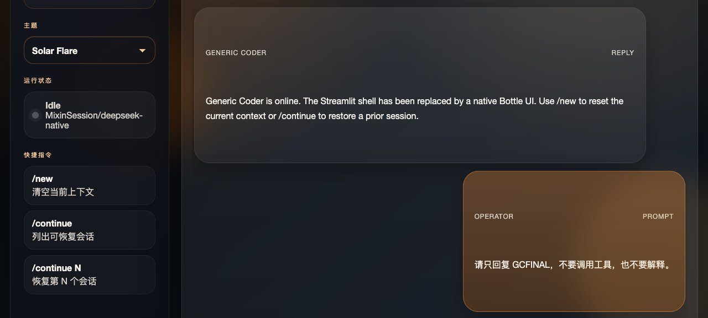
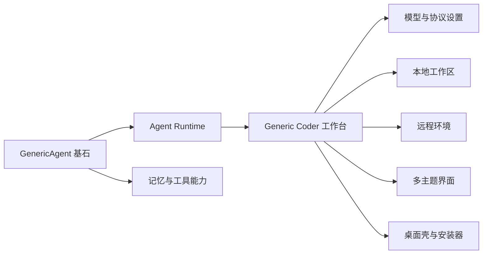

# 把 GenericAgent 改造成类似 Trae SOLO 的代码维护舱

最近 AI 编程产品有点像健身房年卡：看起来谁都能让你变强，但真正天天用的，往往只有少数几个。很多工具的问题不在“模型不够强”，而在“界面不够像人话”。

**Generic Coder** 做的事很明确：它没有另起炉灶重写一套 Agent，而是**基于 GenericAgent 的现有能力，往更适合代码维护的方向做了一次产品化重构**。这点必须说清楚，因为严格按事实讲，它不是脱离 GenericAgent 的全新内核，而是在原有 Agent runtime、记忆机制、工具链和多模型基础上，参考 **Trae SOLO** 的体验，整理出一个更像“代码维护工作台”的形态。

GitHub：<https://github.com/sapsapshen/Generic-Coder>

上面这张图就是项目运行时截图。左边是控制栏，中间是主会话区，底部是输入区。它没有把按钮撒满屏幕，而是选择了克制的布局。这个决定专业：**当工具能力变复杂时，主界面反而应该更简单。**

## 这项目到底“改”了什么？

第一，**前端形态已经切到自定义 Web cockpit**。当前 Web 工作台由 Bottle 驱动，桌面端通过 `launch.pyw` 用 pywebview 包装。这意味着它不是只做了个浏览器演示，而是明确支持 **Web 端和桌面端并存**。

第二，**模型配置终于进了面板，而不是藏在文件深处考验耐心**。现在可以在设置里处理模型、协议、API Key、Base URL、模型名、显示名等参数，并且已经加入常见模型与协议预设。说白了，就是把“会用 AI”往“正常人能配”推进了一步。

第三，**主题切换不是摆设**。当前至少有 `solarflare`、`graphite`、`neonwave`、`daybreak`、`ember` 五套主题。终于不是每个 AI 项目都默认“深色背景加一点神秘紫”。

第四，**本地工作区和远程环境都被纳入了正式能力范围**。很多项目一谈远程就只剩一句“支持 SSH”。而 Generic Coder 这边，已经把工作区、远程连接和执行上下文组织进产品路径里，是在朝真实维护场景靠。

## 为什么说它比“聊天框套 Agent”更靠谱？

这张图的重点不是“功能很多”，而是**分层清楚**。GenericAgent 负责底层执行力，Generic Coder 负责更接近开发者心智的交互壳。前者像发动机，后者像驾驶舱。把两者混成一团，最后往往只会得到一个什么都写了、什么都不好用的庞然大物。

而从目前已知成果看，Generic Coder 已经把几件很关键的事做实了：

- 有真正可运行的界面
- 能自由切换模型
- 能切主题
- 支持本地与远程工作环境
- 生成了 macOS 安装包和 Windows 可执行安装器

这说明它正在从“技术展示”走向“可分发、可维护、可长期使用”的产品形态。专业一点说，这种演进路线比单纯追求功能堆砌靠谱；直白一点说，就是它终于不再像一个“配置自己都得配置半小时”的 AI 工具了。

## 最后一句

如果你想找的不是另一个只会聊天的页面，而是一个**更接近实际代码维护流程、又保留 Agent 执行力**的项目，那 Generic Coder 值得一看。

它最打动人的地方，不是喊口号，而是已经把几件难事串起来了：**基于 GenericAgent、参考 Trae SOLO 体验、支持模型切换、支持多主题、支持 Web 与桌面双形态、支持本地与远程环境、还能打安装包。**